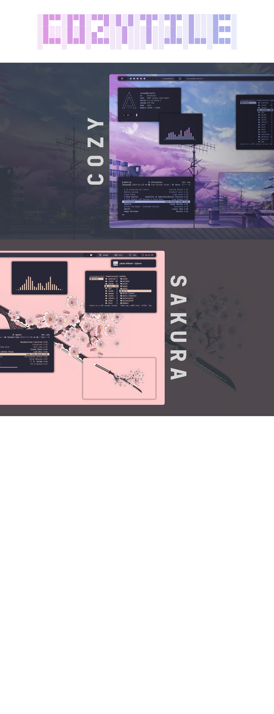

> [!Important]
> New themes and features incoming || Installation script is now up and running.

> [!Note]
> Working with virtual machines? Make sure to enable "3d Acceleration" in the vm settings.


<a href='#'></a>


<div align="left">

Hey there! Dive in and enjoy the setup. Thanks for stopping by!

</div>

<div align="left">

## INSTALLATION  (Arch Linux)
</div>

###### Note: This script is for Arch Linux and works best on a fresh install. If you're switching from another window manager, back up your dotfiles first. The script includes a backup, but it’s always good to keep an extra copy for safety.

<details>
<summary><h3>Automated Installation </h3></summary>

- Clone the repo and cd into the cloned folder.
```sh
git clone https://github.com/Darkkal44/Cozytile 
cd Cozytile
```
###### Now that you're in the cloned folder, it's time to run the script

- Make the script executable
```sh
chmod +x install.sh
```

- Run the script

```sh 
./install.sh
```

###### Once the script finishes its work and launches SDDM, it's time to choose Qtile from the WM selector and dive right into the Amazing world of Qtile!


</details>

> [!note]
>
> Stuck on a pitch-black screen after logging in with SDDM? Just switch to ‘Qtile (Xorg)’ from the top-left corner instead of the default ‘Qtile Wayland’ in the login screen!
<div align="left">

## MANUAL INSTALLATION (Universal)
</div>

###### Note: While this guide is primarily intended for Arch Linux users, If you're running a different OS like Fedora, NixOS, or Debian. You'll still be able to follow along and get a clear idea of how to set things up. (using your OS's package manager and other tools)
######          Keep in mind that this configuration is tailored to assume that the main files, like ".config", will be located in the home folder (~/). However, if that's not the case for you, don't worry - you'll just need to make a few manual adjustments to the dotfiles.

<details>
<summary><h3>Dependencies</h3></summary>

###### To get started, let's make sure we have all the necessary prerequisites. In this case, I'm using Paru as the AUR helper, but keep in mind that your system may require a different approach. 

- Installation using paru

```sh 
paru -Syu base-devel qtile python-psutil pywal-git feh picom-git dunst zsh starship playerctl brightnessctl alacritty pfetch thunar rofi ranger cava pulseaudio alsa-utils neovim vim git sddm --noconfirm --needed

```
- Fonts required for the bar and other utils
###### Copy the contents of the ``fonts/`` folder from this repo to ``.local/share/fonts/`` or ``/usr/share/fonts/``

```sh 
sudo cp -R ./fonts/ /usr/share/fonts/

```
</details>


<details>
<summary><h3>Shell</h3></summary>

##### Next step is to install and setup the shell. 

- Change the default shell to Zsh
```sh 
chsh -s $(which zsh)
```

- Setting up Oh-my-zsh & plugins
```sh 
sh -c "$(curl -fsSL https://raw.githubusercontent.com/ohmyzsh/ohmyzsh/master/tools/install.sh)" "" --unattended 
git clone https://github.com/zsh-users/zsh-autosuggestions ${ZSH_CUSTOM:-~/.oh-my-zsh/custom}/plugins/zsh-autosuggestions
git clone https://github.com/zsh-users/zsh-syntax-highlighting.git ${ZSH_CUSTOM:-~/.oh-my-zsh/custom}/plugins/zsh-syntax-highlighting
```

</details>

<details>
<summary><h3>Dotfiles</h3></summary>

###### With all the necessary prerequisites now installed, the next step is to replicate my setup by copying the dotfiles

- Clone the repo and cd into the cloned folder.
```sh
git clone https://github.com/Darkkal44/Cozytile 
cd Cozytile
```

###### Now that you're in the cloned folder, it's time to copy those files over to your home directory.

- Copy the files using cp
```sh
cp -R ./. ~/
```

</details>

<details>
<summary><h3>Final step</h3></summary>

###### Now that you're done with copying the dotfiles, it's time to hop into Qtile. This requires installing a display manager like sddm. Here are the steps to install sddm:

- Install it using paru
```sh
paru -Sy sddm
```

- Enable and start sddm

```sh
sudo systemctl enable sddm && sudo systemctl start sddm
```
###### Now that you're in the login screen of sddm, just select `Qtile` from wm selector (very important, since it comes with `Qtile wayland` as default), then login with your root password! viola ✨ 

- Enjoy!

##### Congratulations! You have successfully replicated my setup! Feel free to experiment with the configurations and enjoy!!!

</details>


<div align= "left">

## KEYBINDS

</div>

<details>
<summary><h3>Table</h3></summary>

| Key                                                                                                                                                         | Bind                                              |
|:------------------------------------------------------------------------------------------------------------------------------------------------------------|:--------------------------------------------------|
|                                                                                                                                                             |                                                   |
| Qtile Defaults                                                                                                                                              |                                                   |
|                                                                                                                                                             |                                                   |
| <kbd>super</kbd> + <kbd>h</kbd>                                                                                                                             | Move focus to left                                |
| <kbd>super</kbd> + <kbd>l</kbd>                                                                                                                             | Move focus to right                               |
| <kbd>super</kbd> + <kbd>j</kbd>                                                                                                                             | Move focus to down                                |
| <kbd>super</kbd> + <kbd>k</kbd>                                                                                                                             | Move focus to up                                  |
| <kbd>super</kbd> + <kbd>space</kbd>                                                                                                                         | Move window focus to other window                 |
| <kbd>super</kbd> + <kbd>control</kbd> + <kbd>h</kbd>                                                                                                        | Move window to the left                           |
| <kbd>super</kbd> + <kbd>control</kbd> + <kbd>l</kbd>                                                                                                        | Move window to the right                          |   
| <kbd>super</kbd> + <kbd>control</kbd> + <kbd>j</kbd>                                                                                                        | Move window to the down                           |
| <kbd>super</kbd> + <kbd>control</kbd> + <kbd>k</kbd>                                                                                                        | Move window to the up                             |
| <kbd>super</kbd> + <kbd>shift</kbd> + <kbd>h</kbd>                                                                                                          | Grow windows to the left                          |
| <kbd>super</kbd> + <kbd>shift</kbd> + <kbd>l</kbd>                                                                                                          | Grow windows to the right                         |
| <kbd>super</kbd> + <kbd>shift</kbd> + <kbd>j</kbd>                                                                                                          | Grow windows to the down                          |
| <kbd>super</kbd> + <kbd>shift</kbd> + <kbd>k</kbd>                                                                                                          | Grow windows to the up                            |
| <kbd>super</kbd> + <kbd>n</kbd>                                                                                                                             | Reset all window sizes                            |
| <kbd>super</kbd> + <kbd>f</kbd>                                                                                                                             | Toggle fullscreen                                 |
| <kbd>super</kbd> + <kbd>shift</kbd> + <kbd>Return</kbd>                                                                                                     | Toggle between split and unsplit sides of stack   |
| <kbd>super</kbd> + <kbd>Tab</kbd>                                                                                                                           | Toggle between layouts                            |
| <kbd>super</kbd> + <kbd>Control</kbd> + <kbd>r</kbd>                                                                                                        | Restart Qtile                                     |
| <kbd>super</kbd> + <kbd>Control</kbd> + <kbd>q</kbd>                                                                                                        | Shutdown Qtile                                    |
|                                                                                                                                                             |                                                   |
| Custom                                                                                                                                                      |                                                   |
|                                                                                                                                                             |                                                   |
| <kbd>super</kbd> + <kbd>Return</kbd>                                                                                                                        | Launch Terminal                                   |
| <kbd>super</kbd> + <kbd>c</kbd>                                                                                                                             | Close/Kill focused window                         |
| <kbd>super</kbd> + <kbd>r</kbd>                                                                                                                             | App launcher/ Rofi Drun                           |
| <kbd>super</kbd> + <kbd>p</kbd>                                                                                                                             | Rofi Powermenu                                    |
| <kbd>super</kbd> + <kbd>t</kbd>                                                                                                                             | **Rofi Theme_switcher**                             |
| <kbd>super</kbd> + <kbd>e</kbd>                                                                                                                             | Thunar File manager                               |
| <kbd>super</kbd> + <kbd>s</kbd>                                                                                                                             | Flameshot (Screenshot)                            |
| <kbd>super</kbd> + <kbd>h</kbd>                                                                                                                             | Roficlip                                          |


</details>


<div align="left">

## CREDITS

A huge thanks to all my Unixporn Discord friends for their help and support throughout this! While I can't name each of you individually (the list will be huge lol.), please know that I truly appreciate everything you've done. Thank you!
 
Thanks to [claudiotesta](https://unsplash.com/@claudiotesta) for the stunning wallpaper used in the Natura theme. Additionally, I'd like to express my gratitude to all the other artists whose wallpapers I've used in this rice. While I wasn't able to locate the source or artist for every wallpaper, if anyone knows, please don't hesitate to let me know


</div>

---

<div align="center">

#### Have a nice day!

</div>
