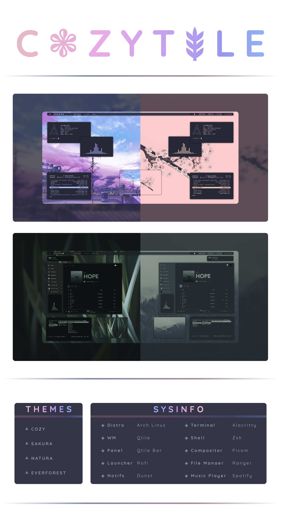

<a href='#'></a>


<div align="left">

#### Hey there, Linux fans! I've been working on a Qtile rice for a while now, and I'm excited to share it with you. I've always been fascinated by the way the bar works in Qtile, so that's what I focused on for this rice. I'm thrilled with the results, and I hope you'll be impressed too.

####Qtile might not be the most popular window manager out there, but it's definitely worth checking out. It has some amazing features and possibilities, and I hope my rice will inspire you to give it a try. So without further ado, here's my Qtile rice - I'm excited to finally show it off! Thanks for taking the time to check it out.

</div>

<div align="center">

## INSTALLATION
</div>

###### Note: This configuration is designed with the assumption that the main files, such as ".config", will be located in the home folder (~/). If this is not the case for you, then you may need to manually adjust the dotfiles

<details>
<summary><h3>Dependencies</h3></summary>

###### The first step is to install the necessary prerequisites. I am using an AUR helper called Paru, but please note that this may differ for you.

- Installation using paru

```sh 
paru -Syu base-devel qtile python-psutil pywal-git picom-jonaburg-fix dunst zsh starship mpd ncmpcpp playerctl brightnessctl alacritty pfetch htop flameshot thunar roficlip rofi ranger cava pulseaudio pavucontrol neovim vim git
```
- Fonts required for the bar and other utils

 ➺ [Font Awesome](https://fontawesome.com/)

 ➺ [JetBrains Mono](https://www.jetbrains.com/lp/mono/)

###### Download the zip files for these fonts, extract them and put them into ``.local/share/fonts/`` or ``/usr/share/fonts/``

</details>

<details>
<summary><h3>Dotfiles</h3></summary>

###### Now that all the necessary prerequisites have been installed, the next step is to copy the dotfiles to replicate my setup! 

- Clone the repo and cd into the cloned folder.
```sh
git clone https://github.com/Darkkal44/CozyTile 
cd Cozytile
```

###### Now that you're in the cloned folder, choose the colorscheme that you'd like to install using the script.

- Execute the script
```sh
chmod +x install
./install
```
###### This script not only provides you with a selection of colorschemes but also creates a backup of the configuration part that will be replaced. In case you want to revert back, the backup is easily available for you. The script will also setup your terminal, it'll install and configure zsh, oh-my-zsh, starship and some plugins.

###### Rerun the script incase you wanna change the colorscheme in the future! More color scheme's coming sooonn!!

</details>

<details>
<summary><h3>Final step</h3></summary>

###### Now that you're done with copying the dotfiles, it's time to hop into Qtile. This requires installing a display manager like sddm. Here are the steps to install sddm:

- Install it using paru
```sh
paru -Sy sddm
```

- Enable and start sddm

```sh
sudo systemctl enable sddm && sudo systemctl start sddm
```
###### Now that you're in the login screen of sddm, just select Qtile from wm selector, then login with your root password! viola ✨ 

- Enjoy!

##### Congratulations! You have successfully replicated my setup! Feel free to experiment with the configurations and enjoy!!!

</details>

---

<div align="center">

#### Thats all!! Have a nice day!

</div>
